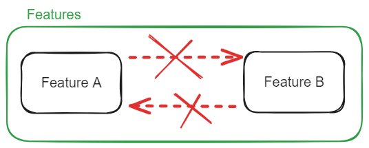
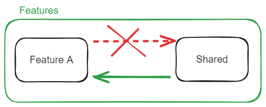
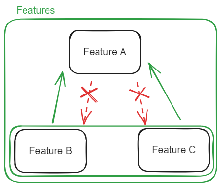

<br />
<div align="center">
  <h1 align="center">Emotion Status - emote your emotions</h1>
</div>

## Table of contents
- [Built With](#built-with)
- [Folder Structure](#app-structure-and-conventions)
- [Getting Started](#getting-started)

## Built With

| Library name     | Description                                                                  |
|------------------|------------------------------------------------------------------------------|
| [react native](https://reactnative.dev/docs/getting-started) with [expo](https://docs.expo.dev/) | Mobile Framework |
| [supabase client](https://supabase.com/docs/reference/javascript/introduction) | Supabase SDK |
| [TanStack query v5 for React](https://tanstack.com/query/v5/docs/framework/react/overview) | Manage Async State |
| [React Hook Form](https://react-hook-form.com/get-started#ReactNative) | Manage Form State |
| [Zod](https://github.com/colinhacks/zod?tab=readme-ov-file#table-of-contents) | Runtime Validation |
| [RNUI](https://wix.github.io/react-native-ui-lib/docs/getting-started/setup) and [React Native Reanimated](https://docs.swmansion.com/react-native-reanimated/) | React Native UI Components |
| [Day.js](https://day.js.org/docs/en/installation/node-js) | Parse, validate, manipulate, and display dates and times |

## Folder Structure

### app
[Expo router](https://docs.expo.dev/router/introduction/)

### features
In the per feature separation there is no clear structure because it depends on business domain. <br>
Don't use the generic folders like utils or components, each folder is a separate feature. <br>
["move files around until it feels right"](https://react-file-structure.surge.sh) with this rules:
- Each module should correspond to a specific functionality or business domain
- Each module can have shared folder with shared files across module and child modules

1. Features at the same folder level are not allowed to import each other. <br>


2. The shared folder is an exception to the first rule and modules can import files from shared folder at the same level. <br>


3. Child features are not allowed to import the parent feature but parent can import children. <br>


### shared 
Same rules like in features folder

## Getting Started
### Prerequisites
- [Node.js minimal v18](https://nodejs.org/en)

### Environment Variables
Copy [.env.example](./.env.example) and rename to .env
<br>
**You can message me ([contact info](https://github.com/Filipo11021)) for environment variables if you want test the app**

### Install Packages

```sh
npm install
```

### Generate Supabase Types

```sh
npm run gen:types
```

### Start a server for developing your app

```sh
npm run start
```
